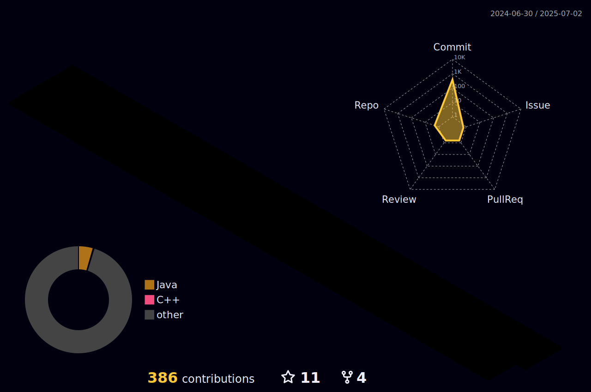

# Parthis Joshi

  

<h1 align="center">Hi there || नमस्ते  </h1>
<h3 align="center">
IND_CLUTCHERS  🏠 JUNAGADH
</h3>

Domain | My Expertise
--- | --- 
**Languages**  |      
**Frameworks & Libraries**  |            
**Domain Knownledge**  |    
**CI / CD** |   
**Databases**  |     
**OS**  |   
**Tools & Platform**  |    

 
 

30

31
  <a align= "center" href="https://github.com/SiddheshKukade">
32
    
33
    
34
    
35
 
36
 -->="left"> 

  

  

 

 

  
  

- 📫 How to reach me **parthisj03@gmail.com**
- 💻 StackOverFlow- [Parthis Joshi](https://stackoverflow.com/users/16320782/parthis)
- 🤖 Kaggle - [Parthis](https://www.kaggle.com/joshiparthis)
  

<h3 align="center">Connect with me:</h3>

 &nbsp;&nbsp;&nbsp;
&nbsp;&nbsp;&nbsp;&nbsp;

<!--
<h2 align="center"> ☁ Google Cloud Badges </h2>

 -->

<!-- 

 -->
<!--  align="left" height="500" width="400"  -->
<!-- 
  -->
<!--  

 -->
<!-- 

  

  -->
<!-- 
 -->

<!--

 <h2 align="center">Open Source Contributions </h2>
